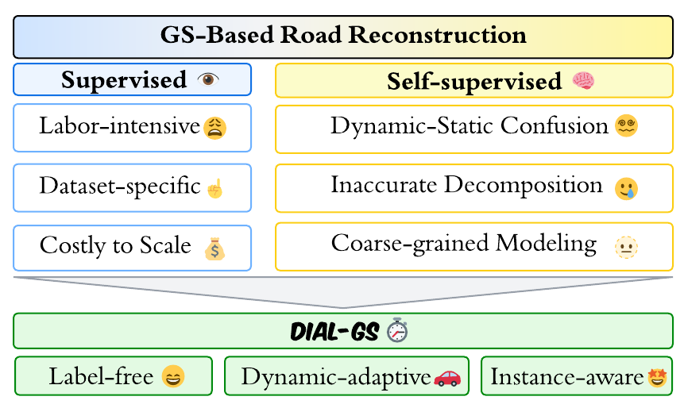
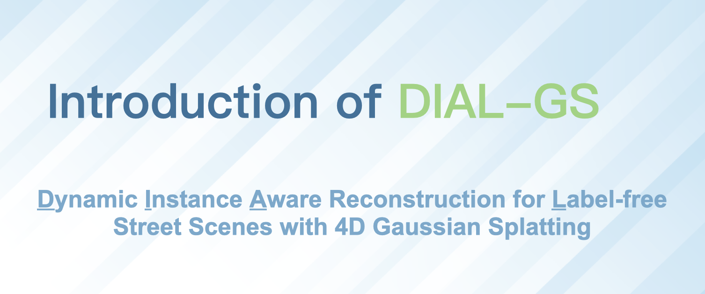
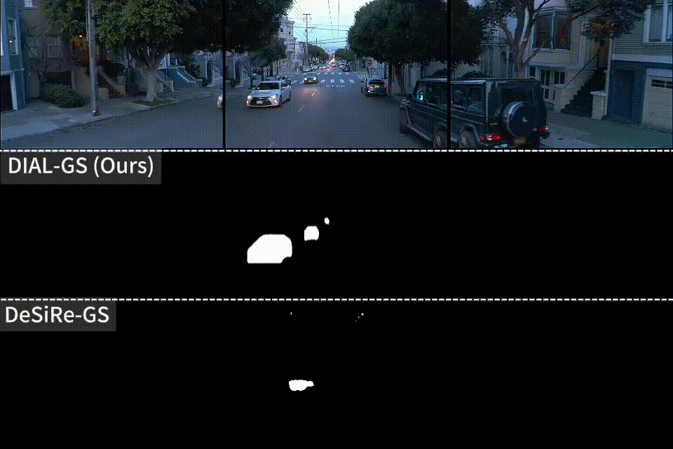

# **DIAL-GS⏱️: Dynamic Instance-Aware Reconstruction for Label-free Street Scenes with 4D Gaussian Splatting** 

> [**DIAL-GS: Dynamic Instance-Aware Reconstruction for Label-free Street Scenes with 4D Gaussian Splatting**](https://arxiv.org/abs/2311.18561)
>
> Chenpeng Su, Wenhua Wu, Chensheng Peng, Tianchen Deng, Zhe Liu, Hesheng Wang
>
> **ICAR 2026**

## 🛠️ Pipeline
<div align="center">
  
</div><br/>


## 🎯 Motivation

<div align="center">
  
</div><br/>


## 🚀 Get Started
### 🧱 Environment

```
# Clone the repo.
git clone https://github.com/IRMVLab/DIAL-GS.git
cd DIAL-GS

# Make a conda environment.
conda create --name dial python=3.9
conda activate dial

# Install requirements.
pip install -r requirements.txt

# Install simple-knn
git clone https://gitlab.inria.fr/bkerbl/simple-knn.git
pip install ./simple-knn

# a modified gaussian splatting (for feature rendering)
git clone --recursive https://github.com/SuLvXiangXin/diff-gaussian-rasterization
pip install ./diff-gaussian-rasterization

# Install nvdiffrast (for Envlight)
git clone https://github.com/NVlabs/nvdiffrast
pip install ./nvdiffrast
```

**Due to version confliction, another conda enviroment is required for boxmot.**

```
# Install boxmot (for tracking)
conda create --name boxmot python=3.10
conda activate boxmot
git clone https://github.com/mikel-brostrom/boxmot.git
pip install ./boxmot
```

### 🗂️ Data Preparation

Create a directory to save the data. Run ```mkdir dataset```.

We provide a sample sequence in [google drive](https://drive.google.com/drive/u/0/folders/1fHQJy0cq9ofADpCxtlfmpCh6nCpcw-mH), you may download it and unzip it to `dataset`.
<details>
<summary>Waymo Dataset</summary>
|                     Source                     | Number of Sequences |       Scene Type        | Description                                                  |
| :--------------------------------------------: | :-----------------: | :---------------------: | ------------------------------------------------------------ |
|    [PVG](https://github.com/fudan-zvg/PVG)     |          4          |         Dynamic         | • Refer to [this page](https://github.com/fudan-zvg/PVG?tab=readme-ov-file#data-preparation). |
|    [OmniRe](https://ziyc.github.io/omnire/)    |          8          |         Dynamic         | • Described as highly complex dynamic<br>• Refer to [this page](https://github.com/ziyc/drivestudio/blob/main/docs/Waymo.md). |
| [EmerNeRF](https://github.com/NVlabs/EmerNeRF) |         64          | 32 dynamic<br>32 static | • Contains 32 static, 32 dynamic and 56 diverse scenes. <br> • We test our code on the 32 static and 32 dynamic scenes. <br> • See [this page](https://github.com/NVlabs/EmerNeRF?tab=readme-ov-file#dataset-preparation) for detailed instructions. |
</details>

<details>
<summary>KITTI Dataset </summary>

|                 Source                  | Number of Sequences | Scene Type | Description                                                  |
| :-------------------------------------: | :-----------------: | :--------: | ------------------------------------------------------------ |
| [PVG](https://github.com/fudan-zvg/PVG) |          3          |  Dynamic   | • Refer to [this page](https://github.com/fudan-zvg/PVG?tab=readme-ov-file#kitti-dataset). |
</details>

For tracking sequences,   `./scripts/sequence_tracking.py` generates tracking videos and saves tracking data in the form of numpy array.  Please refer to [boxmot](https://github.com/mikel-brostrom/boxmot) for more details. 

### 🧪 Training & Evaluation 

The project follows a two-stage optimization pipeline controlled by Hydra/OmegaConf configs in [configs](configs). You can either launch the ready-made shell wrappers ([waymo_stage_1.sh](waymo_stage_1.sh), [waymo_stage_2.sh](waymo_stage_2.sh), [waymo_stage_2_nvs.sh](waymo_stage_2_nvs.sh), [kitti_stage_1.sh](kitti_stage_1.sh), [kitti_stage_2.sh](kitti_stage_2.sh), [kitti_stage_2_nvs.sh](kitti_stage_2_nvs.sh)) or invoke the Python entry points directly as outlined below.

#### 🔍Stage 1 — Static Reconstruction & Dynamic Discovery

##### 1. Build and Warp Instant Gaussian Field 

- Script: [train_stage_1_1.py](train_stage_1_1.py) with configs such as [configs/kitti_stage_1.yaml](configs/kitti_stage_1.yaml) or [configs/waymo_stage_1.yaml](configs/waymo_stage_1.yaml).
- Purpose:  Train the over-filtered static scene and combine it with dynamic candidates to form instant Gaussian filed. Then warp the instant Gaussian filed and save the warped renderings.
- Important Outputs:
  - `detection`:  Ground truth images and corresponding warpped results.
  - `new_points_projection`:  Visualization of candidates points.
  - `refine`:  Inverval visualization of over-filtered static scene

##### 2. Inconsistency Check and Dynamic ID Discovery

- Script: [train_stage_1_2.py](train_stage_1_2.py) 
- Purpose: Derive dynamic scores from the inconsistency between ground truth and warped images. Generate final dynamic ID list from the scores.
- Important Outputs:
  - `dynamic_ids.json`:  Dynamic IDs of each camera.
  - `cubic_scores_line_plot.png`:  Visualization of dynamic scores after cubic amplification.
  - `dynamic_scores.txt`: Dynamci scores of each instance.

#### 🚗Stage 2 — Instance-aware 4D optimization

- Script: [train_stage_2.py](train_stage_2.py) with configs such as [configs/kitti_stage_2.yaml](configs/kitti_stage_2.yaml) or [configs/waymo_stage_2.yaml](configs/waymo_stage_2.yaml).
- Requirements: point the `dynmaic_id_dict_path` flag to the `dynamic_ids.json` created in Stage 1; pass `resume=True` if you want to load the last checkpoint automatically.
- Typical CLI:
  ```bash
  python train_stage_2.py \
      --config configs/kitti_stage_2.yaml \
      source_path=/data/kitti_pvg/training/image_02/0002 \
      model_path=outputs/kitti/0002_stage2 \
      dynmaic_id_dict_path=outputs/kitti/0002_stage1/dynamic_ids.json \
      resume=True
  ```
- What happens: [scene/dynamic_gaussian_model.py](scene/dynamic_gaussian_model.py) trains with per-instance SH coefficients, learns velocity heads (`v_map`) and temporal scaling, periodically upsamples resolutions, and exports renders to `visualization/` plus metrics snapshots in `eval/`.


### ✏️Edition
Instance-level edition is supported by DIAL-GS.  Related scripts are included  in `./modify`. You may need to adjust the parameters carefully for different scenarios to realize the best performance.


## 🏅Quantitative Comparison


## 🎥 Videos
### 🎞️ Introduction
[](https://www.youtube.com/watch?v=DGVvOkT9rtk)


### 🎞️ Rendered Results

https://github.com/user-attachments/assets/cda4a675-872c-48e6-9241-b8dd181e950e

https://github.com/user-attachments/assets/ac5b3b81-4f46-4d69-8ba9-a11915d4470b

https://github.com/user-attachments/assets/7469ca65-4bd3-46fc-8798-0515c853efdb

https://github.com/user-attachments/assets/d826567d-ffda-4aab-b6d7-04d5dc02b350


### 🎞️ Novel View Synthesis 
<div align="center">
  
</div>

### 🎞️ Dynamic Mask Comparison 
<div style="display:flex;flex-wrap:wrap;gap:24px;justify-content:center;align-items:flex-start;">
  
  
</div>

## 📜 BibTeX
```bibtex
@article{su2025dial,
  title={DIAL-GS: Dynamic Instance Aware Reconstruction for Label-free Street Scenes with 4D Gaussian Splatting},
  author={Su, Chenpeng and Wu, Wenhua and Peng, Chensheng and Deng, Tianchen and Liu, Zhe and Wang, Hesheng},
  journal={arXiv preprint arXiv:2511.06632},
  year={2025}
}
```

## :pray: Acknowledgements

We adapted some codes from some awesome repositories including [PVG](https://github.com/fudan-zvg/PVG) and [DeSiRe-GS](https://github.com/chengweialan/desire-gs).
Thank [boxmot](https://github.com/mikel-brostrom/boxmot) for its pluggable and well-developed repository.

